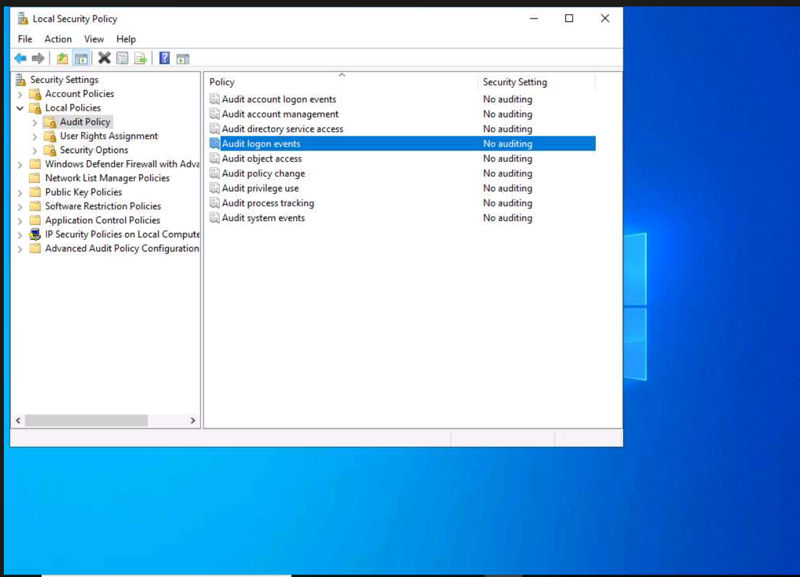

# Exercise 1  Local Logging: Configuring, Monitoring, and Analyzing Windows Logs

# Exercise 1: Local Logging: Configuring, Monitoring, and Analyzing Windows Logs

Windows OS tracks various events, activities, and functions through logs.The events recorded are categorized as application, security, setup, system and forwarded events.

**Lab Scenario**

Log file is an important source that provides the idea to SOC about the flaws or problems and also helps to detect the attack, fraud, inappropriate uses of data.

As a SOC analyst, you should be aware of logging mechanism of Windows OS, location where logs gets stored, configuration needed to log specific type of incidents, format of logs, etc.

**Lab Objectives**

The objective of this lab is to help students learn how to configure, view, and analyze Windows security logs.

steps:::

1- enable audit login event for both correct log in and failed

Navigate to:

```
Local Security Policy → Local Policies → Audit Policy → Audit logon events
```




step 2 

From the attacker machine (Ubuntu), use **Hydra** to brute force the FTP service running on the Windows target at IP `10.10.10.12`:


Hydra successfully found valid credentials:

- **Login:** Administrator
- **Password:** Pa$$w0rd

then log in with the credentials

step 3 

go to event viewer in windows 

On the Windows machine, open **Event Viewer** and navigate to:
`Windows Logs → Security`

You will see a large number of security events logged. Click **Filter Current Log** and enter Event ID **4625** to filter for failed login attempts

**Filter Current Log** window appears, enter the ID 4625 in the Event IDs field and click OK to filter out logs related to login failed attempts.


step 4:

To narrow down results further, switch to the **XML** tab in the Filter window and enable **"Edit query manually"**. Use the following XPath query to filter for Event ID 4625 with **Logon Type 8** (Network Cleartext — typical of FTP):

<QueryList>
<Query Id="0" Path="Security">
<Select Path="Security">
*[System[(EventID=4625)]] and
*[EventData[Data[@Name='LogonType'] and (Data='8')]]
</Select>
</Query>
</QueryList>


change the xml 

Event ID 4625 with a Logon Type of 8 may indicate a potential FTP brute force attack. FTP often uses unencrypted credentials, matching the cleartext authentication method associated with Logon Type 8. Observing multiple instances of Event ID 4625 with Logon Type 8 within a short time span strongly suggests a brute force attack in progress. This pattern of frequent failed login attempts is typical of automated attacks designed to guess passwords.

### Lessons Learned

1. **Audit policy must be configured proactively** — Windows does not log failed logins by default. Enabling "Success & Failure" for Audit Logon Events is a basic but critical hardening step.
2. **Event ID 4625 is a key SOC indicator** — Any spike in this event ID, especially with Logon Type 8, should trigger an alert in a real environment.
3. **Logon Types matter** — Not all failed logins are equal. Logon Type 8 specifically points to cleartext authentication, which narrows down the attack vector significantly (e.g., FTP, HTTP Basic Auth).
4. **XML queries in Event Viewer are powerful** — Using XPath filters allows precise correlation between multiple fields (Event ID + Logon Type), which is closer to how real SIEM queries work.
5. **Hydra is fast** — The brute force completed in under 2 seconds. This highlights why account lockout policies and rate limiting on FTP are essential controls.
6. **FTP is insecure by design** — Credentials sent in cleartext make it trivial for an attacker who already has access to logs or a network capture to retrieve them. SFTP or FTPS should always be preferred.